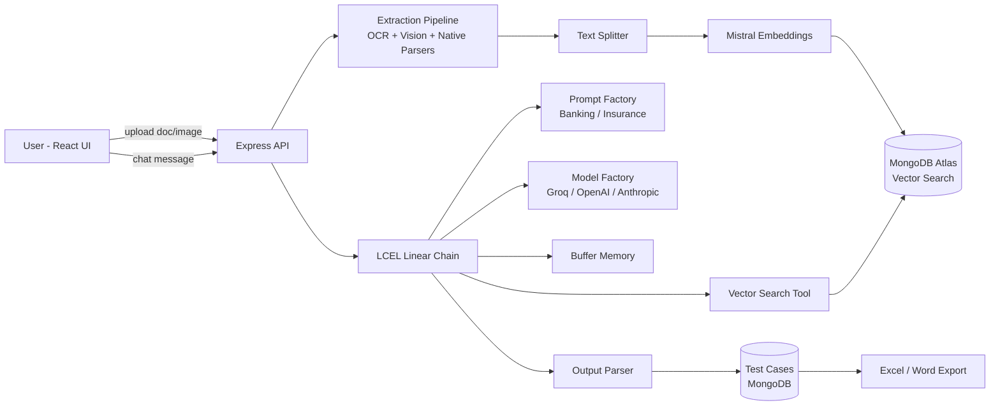

# RAG-Based Multimodal Chat Test Case Generator — Architecture

## 1. Overview

A chat-based application that generates software test cases (Banking / Insurance domains) using a **Simple/Naive RAG** pipeline over text documents and images. Built entirely on **LangChain** primitives: Model Factory, Prompt Factory, MongoDB Atlas Vector Search (as a LangChain Tool), Buffer Memory, and a linear LCEL (pipe) chain.

**Confirmed decisions (from requirements Q&A):**

| # | Decision Area | Choice |
|---|---|---|
| 1 | Input type | Multimodal — text docs + images |
| 2 | Test case output format | Gherkin / Structured / JSON — user selects in UI |
| 3 | Persistence & export | MongoDB storage + Excel/Word export |
| 4 | Vision provider strategy | Try Groq vision first → fallback to configured provider |
| 5 | Image → RAG processing | OCR + vision description combined, then embedded |
| 6 | GIF handling | Extract multiple key frames for context |
| 7 | Vector index setup | Auto-created via startup script |
| 8 | Text splitter defaults | Configurable via `.env`, default = medium (1000/100) |
| 9 | Max file size | Configurable via `.env`, default = 10 MB |
| 10 | Chat memory | In-memory `BufferMemory` for MVP (MongoDB-backed planned later) |
| 11 | Prompt templates | Hardcoded in backend config files |
| 12 | Domain selection | Dropdown per chat session in UI |
| 13 | Frontend scope | Full — Chat + Docs + Test Cases + Admin panel |
| 14 | Auth | None — single-user local MVP |
| 15 | Deployment | Local dev only (`npm run dev`) |

---

## 2. Tech Stack

| Layer | Technology |
|---|---|
| Frontend | React.js + TypeScript (Vite) |
| Backend | Node.js + TypeScript (Express) |
| Database | MongoDB Atlas (documents + Vector Search) |
| Agent/Orchestration Framework | LangChain (LCEL) |
| Embedding Model | Mistral Embed (`mistral-embed`) |
| LLM | Groq (primary), OpenAI / Anthropic (configurable + vision fallback) |
| RAG Type | Simple/Naive RAG, single vector retrieval step |
| Memory | LangChain `BufferMemory` (in-process) |
| File Parsing | pdf-parse, mammoth (docx), xlsx/sheetjs, tesseract.js (OCR), sharp/gif-frames |
| Export | exceljs (Excel), `docx` npm package (Word) |

---

## 3. High-Level Flow



---

## 4. Environment Variables (`.env`)

```ini
# ---------- Server ----------
PORT=5000
NODE_ENV=development

# ---------- MongoDB Atlas ----------
MONGODB_URI=
MONGODB_DB_NAME=testcase_rag
MONGODB_VECTOR_COLLECTION=document_chunks
MONGODB_VECTOR_INDEX_NAME=vector_index

# ---------- LLM Providers (Model Factory) ----------
LLM_PROVIDER=groq                     # groq | openai | anthropic
GROQ_API_KEY=
GROQ_MODEL=                           # e.g. llama-3.3-70b-versatile (verify current model name)
GROQ_VISION_MODEL=                    # verify current Groq vision-capable model name

OPENAI_API_KEY=
OPENAI_MODEL=
OPENAI_VISION_MODEL=

ANTHROPIC_API_KEY=
ANTHROPIC_MODEL=
ANTHROPIC_VISION_MODEL=

VISION_FALLBACK_PROVIDER=openai       # used if Groq vision call fails/unsupported

# ---------- Embeddings ----------
MISTRAL_API_KEY=
MISTRAL_EMBED_MODEL=mistral-embed
EMBEDDING_DIMENSIONS=1024

# ---------- Text Splitter ----------
TEXT_CHUNK_SIZE=1000
TEXT_CHUNK_OVERLAP=100

# ---------- File Upload ----------
MAX_FILE_SIZE_MB=10
SUPPORTED_FILE_TYPES=png,gif,docx,xlsx,pdf
GIF_MAX_FRAMES=5

# ---------- Memory ----------
MEMORY_TYPE=buffer                    # buffer (MVP) | mongo (future)
MEMORY_MAX_MESSAGES=20

# ---------- Logging ----------
LOG_LEVEL=info
```

> ⚠️ Model name placeholders are intentional — verify current model IDs in each provider's docs at implementation time, since these change frequently.

---

## 5. Project Structure

```
/backend
  /src
    /config          → env loader/validator, db connection
    /models          → Mongoose schemas (Document, Chunk, ChatSession, ChatMessage, TestCase)
    /factories
      modelFactory.ts
      promptFactory.ts
    /prompts
      banking.prompt.ts
      insurance.prompt.ts
    /services
      embeddingService.ts
      vectorStoreService.ts
      memoryService.ts
      textSplitterService.ts
      extractionService.ts   → OCR, vision-description, gif frame extraction, docx/xlsx/pdf parsers
      exportService.ts       → excel/word generation
    /chains
      ragChain.ts             → LCEL pipe chain
    /tools
      mongoVectorSearchTool.ts
    /routes
      documents.routes.ts
      chat.routes.ts
      testcases.routes.ts
      domains.routes.ts
      admin.routes.ts
      health.routes.ts
    /controllers
    server.ts
  .env.example

/frontend
  /src
    /api            → axios client
    /pages           → Chat, Documents, TestCases, Admin
    /components
    /context         → session/domain state
    App.tsx
  .env.example

Architecture.md
```

---

## 6. Core Data Models (MongoDB)

**Document**
```ts
{
  _id, filename, fileType, domain, sizeBytes,
  status: 'uploaded'|'processing'|'chunked'|'embedded'|'failed',
  uploadedAt, metadata: { pages?, frames?, sheets? }
}
```

**DocumentChunk** (vector store collection)
```ts
{
  _id, documentId, domain, chunkIndex, text,
  embedding: number[1024],
  sourceType: 'native-text'|'ocr'|'vision'|'ocr+vision',
  metadata: { page?, frame? }
}
```

**ChatSession**
```ts
{ _id, domain, createdAt, lastActiveAt }
```

**ChatMessage** (for UI history — separate from LLM's in-memory BufferMemory)
```ts
{ _id, sessionId, role: 'user'|'assistant', content, hasImage, createdAt }
```

**TestCase**
```ts
{
  _id, sessionId, domain,
  format: 'gherkin'|'structured'|'json',
  title, content, sourceDocumentIds: [],
  createdAt
}
```

---

## 7. Core Design Patterns

### 7.1 Model Factory
`modelFactory.getChatModel({ hasImage })`:
1. Reads `LLM_PROVIDER` from `.env`.
2. If `hasImage === true`: attempts the provider's configured vision model (`GROQ_VISION_MODEL` first, per decision #4).
3. On failure/unsupported → falls back to `VISION_FALLBACK_PROVIDER`'s vision model.
4. Returns a LangChain `BaseChatModel` instance (`ChatGroq` / `ChatOpenAI` / `ChatAnthropic`).

### 7.2 Prompt Factory
`promptFactory.getPromptTemplate(domain: 'banking' | 'insurance')` returns a `ChatPromptTemplate` loaded from hardcoded files in `/prompts`. Includes format-specific instructions (Gherkin/Structured/JSON) injected as a variable based on the user's UI selection.

### 7.3 MongoDB Vector Search as a LangChain Tool
```ts
const mongoVectorSearchTool = new DynamicStructuredTool({
  name: "mongodb_vector_search",
  description: "Retrieves relevant document chunks from MongoDB Atlas Vector Search for a given query and domain.",
  schema: z.object({ query: z.string(), domain: z.enum(["banking","insurance"]), k: z.number().default(5) }),
  func: async ({ query, domain, k }) => vectorStoreService.similaritySearch(query, domain, k),
});
```
Note: Since this is **Simple/Naive RAG**, the tool is invoked deterministically as the first step of the linear chain — not dynamically selected by an agent.

### 7.4 Memory
`memoryService` maintains a `Map<sessionId, BufferMemory>` in process memory (decision #10). `MEMORY_MAX_MESSAGES` caps buffer length. Marked for future migration to `MongoDBChatMessageHistory`.

### 7.5 Chain (LCEL Linear Pipe)
```ts
const ragChain = RunnableSequence.from([
  {
    context: (input) => mongoVectorSearchTool.func({ query: input.question, domain: input.domain, k: 5 }),
    chat_history: (input) => memoryService.getMemory(input.sessionId).loadMemoryVariables({}),
    question: (input) => input.question,
    domain: (input) => input.domain,
    format: (input) => input.format,
  },
  (vars) => promptFactory.getPromptTemplate(vars.domain).format(vars),
  (prompt) => modelFactory.getChatModel({ hasImage: input.hasImage }).invoke(prompt),
  outputParser, // Gherkin/StringOutputParser or StructuredOutputParser per requested format
]);
```

### 7.6 Text Splitter
`RecursiveCharacterTextSplitter` triggered automatically at the end of the extraction pipeline for every uploaded document, using `TEXT_CHUNK_SIZE` / `TEXT_CHUNK_OVERLAP` from `.env`.

### 7.7 Multimodal Document Processing
| File Type | Pipeline |
|---|---|
| PDF | LangChain `PDFLoader` → native text |
| DOCX | `mammoth` → native text |
| XLSX | `xlsx`/SheetJS → text/markdown table |
| PNG | OCR (tesseract.js) **+** Vision-model description (Model Factory) → combined text (decision #5) |
| GIF | Extract up to `GIF_MAX_FRAMES` key frames → OCR + vision per frame → combined into one document context (decision #6) |

All outputs converge into the same Text Splitter → Embedding → Vector Store pipeline.

---

## 8. API Endpoint Reference

| Method | Endpoint | Purpose |
|---|---|---|
| GET | `/api/health` | Server + DB health check |
| GET | `/api/domains` | List available domains for UI dropdown |
| POST | `/api/documents/upload` | Upload + process a document/image |
| GET | `/api/documents` | List uploaded documents |
| DELETE | `/api/documents/:id` | Delete a document + its chunks |
| POST | `/api/chat` | Send chat message (text/image), returns AI response |
| POST | `/api/testcases` | Persist a generated test case |
| GET | `/api/testcases` | List/filter test cases |
| GET | `/api/testcases/:id` | Get single test case |
| GET | `/api/testcases/:id/export?format=excel\|word` | Export test case |
| GET | `/api/admin/prompts` | Read-only view of hardcoded prompt templates |

---

## 9. Implementation Phases

> **Rule for every phase below: implement → demo/explain → wait for explicit approval before starting the next phase.**

### 🔧 Backend Phases (strict priority)

**Phase 1 — Project Scaffolding & Env Setup**
Node.js + TypeScript + Express skeleton, `.env` loader/validator, folder structure, `GET /api/health`, logger setup.

**Phase 2 — MongoDB Atlas Connection & Vector Index Bootstrap**
Mongoose connection, all schemas, startup script to auto-create the Atlas Vector Search index (1024-dim, matching Mistral embed).

**Phase 3 — Model Factory**
Provider abstraction (Groq/OpenAI/Anthropic), vision-model switch logic with Groq-first + fallback (decision #4).

**Phase 4 — Prompt Factory**
Hardcoded Banking/Insurance templates, `GET /api/domains`.

**Phase 5 — Embedding Service**
Mistral Embed wrapper (`embedDocuments`, `embedQuery`).

**Phase 6 — Document Upload & Multimodal Extraction Pipeline**
Multer upload (size limit from `.env`), per-type extraction incl. OCR+vision combination and GIF multi-frame extraction, `POST /api/documents/upload`, `GET/DELETE /api/documents`.

**Phase 7 — Text Splitter & Chunking Service**
Auto-triggered chunking with configurable size/overlap.

**Phase 8 — Vector Store Tool & Mongo Tool Calling**
`MongoDBAtlasVectorSearch` integration + `mongoVectorSearchTool`.

**Phase 9 — Memory Service**
In-memory `BufferMemory` per session.

**Phase 10 — RAG Chain & Chat API**
LCEL linear chain wiring retriever → prompt → model → parser → memory; `POST /api/chat` (handles multimodal input mid-chat).

**Phase 11 — Test Case Persistence & Export**
`TestCase` schema, format-aware output parsing, save/list/get endpoints, Excel/Word export via `exceljs`/`docx`.

**Phase 12 — Admin API (Prompt Viewer)**
`GET /api/admin/prompts` (read-only).

### 🎨 Frontend Phases (after full backend approval)

**Phase 13 — Frontend Scaffolding**
Vite + React + TS, routing (`/chat`, `/documents`, `/testcases`, `/admin`), API client, layout/nav.

**Phase 14 — Document Manager UI**
Drag-drop upload, type/size validation, document list with status, delete.

**Phase 15 — Chat Interface UI**
Domain dropdown, chat window, image attach, output-format selector (Gherkin/Structured/JSON), session handling.

**Phase 16 — Test Case Viewer & Export UI**
List/filter test cases, Excel/Word download buttons.

**Phase 17 — Admin Panel UI**
Read-only Banking/Insurance prompt display with a note that editing requires a redeploy (DB-backed editing is a future phase).

**Phase 18 — Integration Testing & Local Run Docs**
End-to-end walkthrough, `.env.example` for both apps, README with `npm run dev` instructions for local-only deployment.

---

## 10. Explicitly Deferred (Future Phases, Not in MVP)

- MongoDB-backed persistent chat memory (`MongoDBChatMessageHistory`)
- DB-editable prompt templates + admin write API
- Authentication (JWT/OAuth)
- Docker Compose / cloud deployment
- IaC-managed vector index (Terraform/Atlas CLI)
