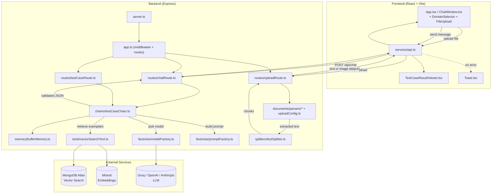

# LangChain Test Case Generator (RAG)

A multimodal, RAG-powered test case generator. Upload a requirements document (PDF/DOCX/XLSX) or a UI screenshot (PNG/GIF), pick a domain (**banking**, **insurance**, or **hospital**), and chat with the system to generate and iteratively refine a structured, schema-validated list of test cases. Retrieval-augmented generation pulls similar exemplar test cases from a MongoDB Atlas vector store to ground the LLM's output, and multi-turn memory lets you ask for "one more edge case" without losing prior context.

**Stack:** Node.js / Express / TypeScript backend · React + Vite + TypeScript frontend · MongoDB Atlas (Vector Search) · LangChain JS · Mistral embeddings · Groq / OpenAI / Anthropic as pluggable LLM providers.

---

## 1. High-Level Flow



---

## 2. Repository Layout

```
.
├── Architecture.md          # original phase-by-phase design spec for this project
├── INSTALL.md                # setup / install instructions
├── backend/
│   ├── postman_collection.json
│   └── src/
│       ├── server.ts
│       ├── app.ts
│       ├── config/{env.ts, db.ts}
│       ├── factories/{modelFactory.ts, promptFactory.ts}
│       ├── tools/vectorSearchTool.ts
│       ├── splitters/textSplitter.ts
│       ├── documents/{uploadConfig.ts, parsers/{pdfParser,docxParser,excelParser,imageHandler}.ts}
│       ├── memory/bufferMemory.ts
│       ├── chains/testCaseChain.ts
│       ├── routes/{uploadRoute.ts, chatRoute.ts, testCaseRoute.ts}
│       └── utils/logger.ts
└── frontend/
    └── src/
        ├── main.tsx, App.tsx, App.css, index.css, vite-env.d.ts
        ├── services/api.ts
        └── components/{DomainSelector,ChatWindow,FileUpload,TestCaseResultViewer,Toast}.tsx
```

---

## 3. Backend — File by File

### Entry & app wiring
| File | Functionality |
|---|---|
| `server.ts` | Process entry point. Calls `connectDB()`, then `createApp()`, then starts the HTTP listener on `env.PORT`. |
| `app.ts` | `createApp()` builds the Express app: JSON body parsing (15mb limit, for base64 image data URLs), CORS, Morgan request logging, registers `GET /api/health` plus the upload/chat/testcase routers, and a tail of error-handling middleware (Multer errors → 413/400, `UnsupportedFileTypeError` → 400, JSON `SyntaxError` → 400, 404 handler, generic 500 fallback). |

### Configuration
| File | Functionality |
|---|---|
| `config/env.ts` | Loads and validates all environment variables (`PORT`, Mongo connection settings, `ACTIVE_PROVIDER` + per-provider API keys/model names for Groq/OpenAI/Anthropic, `MISTRAL_API_KEY`/`MISTRAL_EMBED_MODEL`, `CHUNK_SIZE`/`CHUNK_OVERLAP`, `RAG_TOP_K`, per-file-type upload size limits). `validateEnv()` fails fast at startup if the active provider's key or the Mistral key is missing. |
| `config/db.ts` | `connectDB()` opens the Mongoose connection to MongoDB Atlas; `getDBConnectionState()` reports connection status for the health check; `getNativeCollection<T>(name)` exposes a raw MongoDB collection handle for vector search operations. |

### LLM & prompt factories
| File | Functionality |
|---|---|
| `factories/modelFactory.ts` | Provider-agnostic model factory. `getModel({ modality: "text" \| "vision" })` returns a configured chat model from whichever provider is active (`buildGroq`/`buildOpenAI`/`buildAnthropic`), so the rest of the app never hardcodes a provider. |
| `factories/promptFactory.ts` | `getPrompt(domain)` returns a `ChatPromptTemplate` for one of the three domains (`banking`, `insurance`, `hospital`). Each template bakes in domain terminology, the exact JSON output contract the LLM must follow, a `{history}` placeholder for multi-turn chat, and instructions for how to behave on refinement turns. |

### Retrieval (RAG)
| File | Functionality |
|---|---|
| `tools/vectorSearchTool.ts` | Wraps a MongoDB Atlas Vector Search collection as a LangChain vector store, embedding documents with `MistralAIEmbeddings`. `searchSimilarTestCases(query, k)` retrieves the `k` most similar exemplar test cases to ground generation; `addTestCaseToKB()` can persist new ones back into the knowledge base. |

### Document ingestion
| File | Functionality |
|---|---|
| `splitters/textSplitter.ts` | `splitDocumentText(text)` chunks extracted document text using `RecursiveCharacterTextSplitter`, sized via `CHUNK_SIZE`/`CHUNK_OVERLAP`. |
| `documents/uploadConfig.ts` | `detectKind()` maps a filename to `pdf \| docx \| excel \| image`; `validateFileSize()` enforces the per-kind size limit; `uploadMiddleware` is the Multer config (memory storage, file-type filter) used by the upload route; defines `UnsupportedFileTypeError`. |
| `documents/parsers/pdfParser.ts` | `parsePdf(buffer)` extracts plain text from a PDF using `pdf-parse`. |
| `documents/parsers/docxParser.ts` | `parseDocx(buffer)` extracts plain text from a DOCX using `mammoth`. |
| `documents/parsers/excelParser.ts` | `parseExcel(buffer)` reads every sheet/row with `ExcelJS` and flattens it into `"Sheet: name"` + pipe-joined row text. |
| `documents/parsers/imageHandler.ts` | `toImagePayload(buffer, originalName)` base64-encodes an uploaded image and builds a `data:` URL for the vision model path (no text parsing for images). |

### Memory & generation chain
| File | Functionality |
|---|---|
| `memory/bufferMemory.ts` | Per-session chat history. `getSessionHistory(sessionId)` returns (creating if needed) an `InMemoryChatMessageHistory`; `clearSessionHistory()` discards a session. Backs multi-turn refinement without a database. |
| `chains/testCaseChain.ts` | The core orchestration: builds a `RunnableSequence` of prompt → model → `JsonOutputParser`, validated against a Zod test-case schema with up to 3 retry attempts on malformed output. Exposes `chatGenerateTestCases()` (stateful, memory-backed — turn 1 generates, turn 2+ refines), `generateTestCases()` (stateless one-shot text), and `generateTestCasesFromImage()` (stateless one-shot vision, skips RAG retrieval). For text input it first calls `retrieveExemplarContext()` against the vector store; for image input it routes straight to the vision model with no retrieval step. |

### Routes
| File | Functionality |
|---|---|
| `routes/uploadRoute.ts` | `POST /api/upload` — runs Multer, detects file kind, and either (a) parses + chunks a document and returns `extractedText`/`chunkCount`, or (b) converts an image to a base64 `dataUrl`. Returns 400/413/422 on type/size/parse errors. |
| `routes/chatRoute.ts` | `POST /api/chat` — stateful multi-turn endpoint. Validates `domain`/`message`, generates a `sessionId` if absent, calls `chatGenerateTestCases()`, and returns the session id plus the full test-case JSON contract so the client can keep refining. |
| `routes/testCaseRoute.ts` | `POST /api/generate-testcases` — stateless one-shot endpoint. Validates that exactly one of `requirementsText` or `imageDataUrl` is supplied, runs the same chain in a throwaway session, and discards the session afterward. |

### Utilities
| File | Functionality |
|---|---|
| `utils/logger.ts` | `logInfo()`/`logError()` — timestamped console logging used across routes and the chain for observability. |

---

## 4. Frontend — File by File

| File | Functionality |
|---|---|
| `main.tsx` | App bootstrap: mounts React into the DOM wrapped in `StrictMode`, `BrowserRouter`, and `ToastProvider`. |
| `App.tsx` | Top-level component. Renders the header, `DomainSelector`, and `ChatWindow`; keys `ChatWindow` by `domain` so switching domains cleanly resets the conversation. Single `/` route with a catch-all redirect. |
| `services/api.ts` | Typed HTTP client for all four backend endpoints: `getHealth()`, `uploadFile()` (XMLHttpRequest with upload-progress events), `generateTestCases()`, `chat()`. Defines shared request/response types (`Domain`, `TestCase`, `ChatResult`, `UploadResponse`, etc.) and an `ApiError` class. |
| `components/DomainSelector.tsx` | Dropdown to choose `banking \| insurance \| hospital`, driving which backend prompt template is used. |
| `components/FileUpload.tsx` | Client-side file picker with type/size validation (mirroring backend limits via `VITE_*` env vars), an upload progress bar, and success/error chips. Calls `services/api.ts#uploadFile`. |
| `components/ChatWindow.tsx` | Main chat UI. Manages `sessionId`, message history, the text input, and an optional pending image attachment. Sends messages via `chat()`, renders results through `TestCaseResultViewer`, shows inline error bubbles + toast notifications on failure (restoring the user's input so nothing is lost), and supports a "New Chat" reset. |
| `components/TestCaseResultViewer.tsx` | Renders a `TestCaseGenerationResult` as domain/source badges plus expandable/collapsible cards (one per test case: title, numbered steps, expected result), with Expand All / Collapse All controls. |
| `components/Toast.tsx` | `ToastProvider` + `useToast()` hook for transient, auto-dismissing error/info notifications (operational failures only — inline validation messages stay separate since they aren't transient). |
| `App.css` / `index.css` | Layout, component, and design-token styles (colors, spacing, per-domain accent colors, button/spinner/toast styling). |
| `vite-env.d.ts` | TypeScript ambient types for the `VITE_*` environment variables consumed by `api.ts` and `FileUpload.tsx`. |

---

## 5. API Endpoints

| Method | Path | Defined in | Purpose |
|---|---|---|---|
| `GET` | `/api/health` | `app.ts` | Liveness/DB-connection check. |
| `POST` | `/api/upload` | `routes/uploadRoute.ts` | Upload + parse a document, or convert an image to a data URL. |
| `POST` | `/api/generate-testcases` | `routes/testCaseRoute.ts` | Stateless one-shot test case generation from text or an image. |
| `POST` | `/api/chat` | `routes/chatRoute.ts` | Stateful, multi-turn generation/refinement, keyed by `sessionId`. |

---

## 6. End-to-End Request Flows

### 6.1 Upload a document or screenshot
1. User picks a file in `FileUpload.tsx` → client-side type/size check.
2. `services/api.ts#uploadFile()` → `POST /api/upload` (XHR, tracks progress).
3. `uploadRoute.ts`: Multer validates → `uploadConfig.ts#detectKind()`.
   - **Document** (pdf/docx/xlsx): the matching parser in `documents/parsers/` extracts text → `splitters/textSplitter.ts` chunks it → response returns `extractedText` + `chunkCount`.
   - **Image** (png/gif): `imageHandler.ts#toImagePayload()` → response returns a `dataUrl`.
4. `ChatWindow.tsx` prefills the textarea with the extracted text, or shows an image preview/attachment banner.

### 6.2 Generate / refine test cases via chat
1. User types a message (optionally with an attached image) and hits Send in `ChatWindow.tsx`.
2. `services/api.ts#chat()` → `POST /api/chat` with `{ domain, message, imageDataUrl?, sessionId? }`.
3. `chatRoute.ts` validates input, assigns a `sessionId` on first turn, calls `chains/testCaseChain.ts#chatGenerateTestCases()`.
4. Inside the chain:
   - `memory/bufferMemory.ts#getSessionHistory()` loads prior turns for this session.
   - **Text path:** `tools/vectorSearchTool.ts#searchSimilarTestCases()` retrieves similar exemplars from MongoDB Atlas (via Mistral embeddings) to ground the prompt.
   - **Vision path:** retrieval is skipped; the image is sent directly to a vision-capable model.
   - `factories/promptFactory.ts#getPrompt(domain)` builds the prompt; `factories/modelFactory.ts#getModel()` selects the active LLM provider.
   - Output is parsed as JSON and validated against the Zod test-case schema, retrying up to 3 times on malformed responses.
   - The new turn is appended to session history.
5. `chatRoute.ts` returns `{ sessionId, domain, sourceType, testCases[] }`.
6. `ChatWindow.tsx` stores the `sessionId` for the next refinement turn and renders the result via `TestCaseResultViewer.tsx`; failures surface as an inline error bubble + toast, with the user's input restored.

The one-shot `/api/generate-testcases` endpoint runs the identical chain logic in a throwaway session that is discarded immediately after the response is built.

---

## 7. Environment Variables

**Backend (`backend/.env`)**
- `PORT` — server port (default `5000`)
- `MONGODB_URI`, `MONGODB_DB_NAME`, `MONGODB_VECTOR_COLLECTION`, `MONGODB_VECTOR_INDEX_NAME` — MongoDB Atlas connection + vector index
- `ACTIVE_PROVIDER` — `groq` | `openai` | `anthropic`
- `GROQ_API_KEY` / `GROQ_TEXT_MODEL` / `GROQ_VISION_MODEL`
- `OPENAI_API_KEY` / `OPENAI_TEXT_MODEL` / `OPENAI_VISION_MODEL`
- `ANTHROPIC_API_KEY` / `ANTHROPIC_TEXT_MODEL` / `ANTHROPIC_VISION_MODEL`
- `MISTRAL_API_KEY`, `MISTRAL_EMBED_MODEL` — embeddings for RAG (required regardless of `ACTIVE_PROVIDER`)
- `CHUNK_SIZE`, `CHUNK_OVERLAP` — text splitter config
- `RAG_TOP_K` — number of exemplar test cases retrieved per generation
- `MAX_UPLOAD_SIZE_PDF` / `_DOCX` / `_EXCEL` / `_IMAGE`, `ALLOWED_IMAGE_TYPES` — upload limits

**Frontend (`frontend/.env`)**
- `VITE_API_BASE_URL` — backend base URL (must match the backend's actual `PORT`)
- `VITE_MAX_UPLOAD_SIZE_PDF` / `_DOCX` / `_EXCEL` / `_IMAGE` — mirrors backend limits for client-side validation
- `VITE_ALLOWED_IMAGE_TYPES` — comma-separated allowed image extensions

---

## 8. Scripts

**Backend**
```bash
npm run dev    # tsx watch src/server.ts — dev server with file watching
npm run build  # tsc -p tsconfig.json   — compile to dist/
npm start      # node dist/server.js    — run compiled build
```

**Frontend**
```bash
npm run dev      # vite — dev server
npm run build    # tsc -b && vite build
npm run preview  # vite preview
npm run lint     # oxlint
```

See [INSTALL.md](INSTALL.md) for full setup instructions and [Architecture.md](Architecture.md) for the original phase-by-phase design spec.
